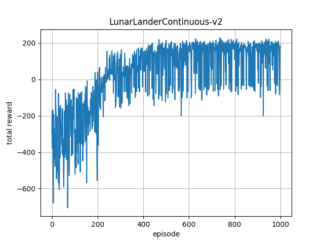
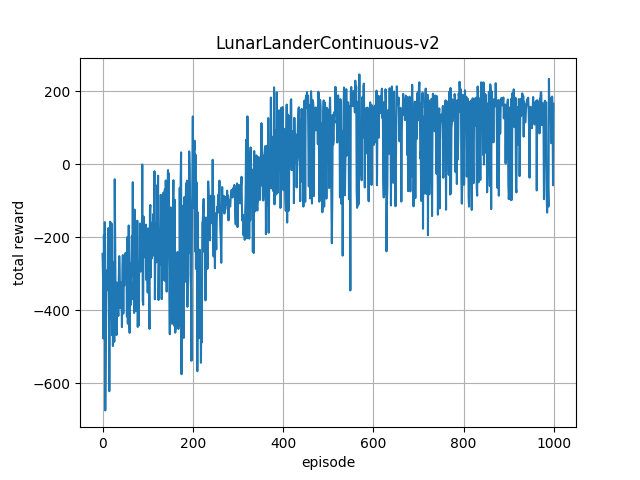

# Reinforcement learning toolbox (Unfinished)
Some Reinforcement learning algorithms implemented in PyTorch.
## 1. Result

### LunarLanderContinuous
MLP policy | MLP LSTM policy
-----------|----------------
 | 

### CarRacing
CNN policy | CNN LSTM policy | VisualMemory policy
-----------|-----------------|--------------------
 | |

## 2. Setup
Install dependencies according to [requirements.txt](requirements.txt).
## 3. Run

Kinda WorldModel:

    python3 01_train_cnn_policy.py
    python3 02_collect_data.py
    python3 03_train_vae.py
    python3 04_convert_weights.py
    python3 05_train_ppo.py
## 4. TODO
[Noisy Networks for Exploration](https://arxiv.org/abs/1706.10295)

[Parameter Space Noise for Exploration](https://arxiv.org/abs/1706.01905)

## Reference
[Emergence of Locomotion Behaviours in Rich Environments](https://arxiv.org/abs/1707.02286)

[Proximal Policy Optimization Algorithms](https://arxiv.org/abs/1707.06347)

[openai/baselines](https://github.com/openai/baselines)

[World Models](https://worldmodels.github.io/)
## License
This project is released under MIT License. Please review [License](LICENSE) file for more details.

