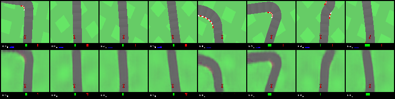
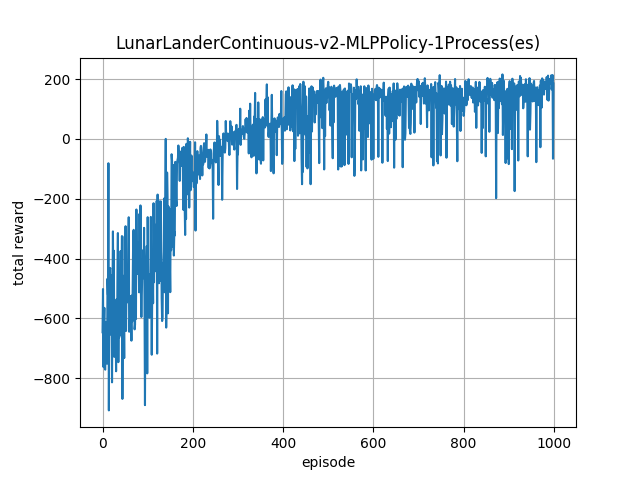
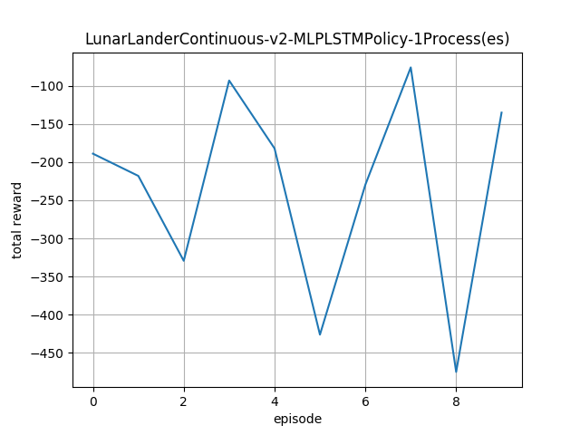

# (Unfinished)
Some Reinforcement learning algorithms implemented in PyTorch.

## 1. Result

VAE |
----|
 |

### 1.1 LunarLanderContinuous

MLP policy | MLP LSTM policy
-----------|----------------
 | 

### 1.2 CarRacing

CNN policy | CNN LSTM policy | VisualMemory policy
-----------|-----------------|--------------------
 | |

## 2. Setup

Install dependencies according to [requirements.txt](requirements.txt).

## 3. Run

Test PPO in LunarLanderContinuous (Example of how to use toolbox)

```bash
    python3 test_ppo.py
```

Kinda WorldModel:

```bash
    python3 01_train_cnn_policy.py
    python3 02_collect_data.py
    python3 03_train_vae.py
    python3 04_convert_weights.py
    python3 05_train_combined_policy.py
```

## 4. Learned

1. CNN poliyc can learn to recovery from over-turning.
But to make it happend some tricks are needed.
First train CNN pilcy with absolute output limited to 0.2 for like 1000 episodes.
Then gradually release it's full potential to 1.0 for many other 1000 opisodes.

1.

## 5. TODO
[Noisy Networks for Exploration](https://arxiv.org/abs/1706.10295)

[Parameter Space Noise for Exploration](https://arxiv.org/abs/1706.01905)


## Reference
[Emergence of Locomotion Behaviours in Rich Environments](https://arxiv.org/abs/1707.02286)

[Proximal Policy Optimization Algorithms](https://arxiv.org/abs/1707.06347)

[openai/baselines](https://github.com/openai/baselines)

[World Models](https://worldmodels.github.io/)
## License
This project is released under MIT License. Please review [License](LICENSE) file for more details.

