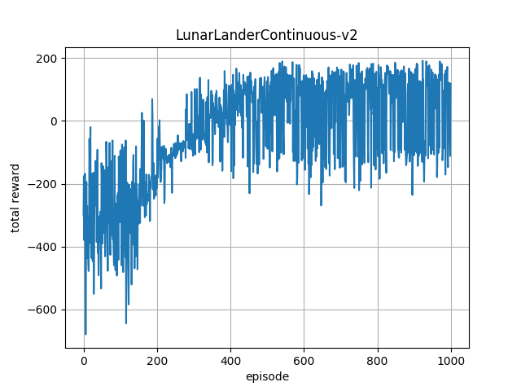

# Reinforcement learning toolbox (Unfinished)
Reinforcement learning algorithms implemented in PyTorch.
## 1. Result

## 2. Setup
Install dependencies according to [requirements.txt](requirements.txt).
## 3. Run

    python3 test_ppo.py
## 4. TODO
[Noisy Networks for Exploration](https://arxiv.org/abs/1706.10295)

[Parameter Space Noise for Exploration](https://arxiv.org/abs/1706.01905)

## Reference
[Emergence of Locomotion Behaviours in Rich Environments](https://arxiv.org/abs/1707.02286)

[Proximal Policy Optimization Algorithms](https://arxiv.org/abs/1707.06347)

[openai/baselines](https://github.com/openai/baselines)
## License
This project is released under MIT License. Please review [License](LICENSE) file for more details.

