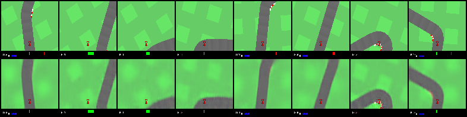

# Reinforcement Learning Practice(Unfinished)

Try to implement some RL related algorithm in PyTorch.

## 1. Result

| VAE
|-----
| 

### 1.1 LunarLanderContinuous

| MLP policy
|-----------
| 

### 1.2 CarRacing

| CNN policy
|-----------
| 

| Visual policy
|--------------
| 


## 2. Setup

Install dependencies according to [requirements.txt](requirements.txt).

## 3. Run

Test PPO in LunarLanderContinuous (Example of how to use toolbox)

```
    python3 test_mlp_ppo.py
```

```
    python3 01_train_cnn_policy.py
    python3 02_collect_data.py
    python3 03_train_vae.py
    python3 04_convert_weights.py
    python3 05_train_visual_policy.py
    python3 06_train_combined_policy.py
```

## 4. Lessons Learned
1. An argument controlled switch between CPU and GPU is necessary.

1. Debug on CPU. It gives better error info. CUDA runtime error makes me :scream:.

1. First test on low dim environment using MLP model. Minimize influences from non-core codes.

1. nan. may be the source of all mysterious bugs.

1. Work or not sometimes depend on seed.

1. CNN policy can learn to recovery from over-turning.
But to make it happend some tricks are needed.
First train CNN pilcy with absolute output limited to 0.2 for like 1000 episodes.
Then gradually release it's full potential to 1.0 for many other 1000 opisodes.

## 5. TODO
Make MDN work.

Make LSTM better(or correct).

[Noisy Networks for Exploration](https://arxiv.org/abs/1706.10295)

[Parameter Space Noise for Exploration](https://arxiv.org/abs/1706.01905)

## Reference

[Emergence of Locomotion Behaviours in Rich Environments](https://arxiv.org/abs/1707.02286)

[Proximal Policy Optimization Algorithms](https://arxiv.org/abs/1707.06347)

[openai/baselines](https://github.com/openai/baselines)

[World Models](https://worldmodels.github.io/)

[Training-PPO](https://github.com/Unity-Technologies/ml-agents/blob/master/docs/Training-PPO.md)

## License
This project is released under MIT License. Please review [License](LICENSE) file for more details.

